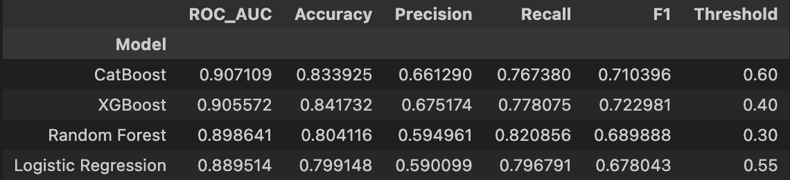
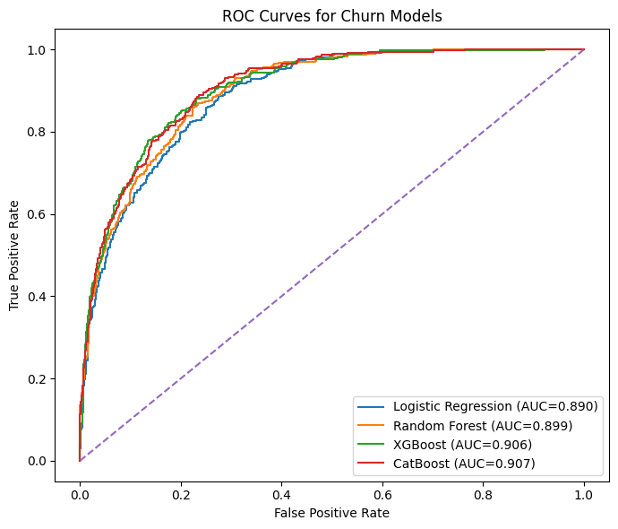
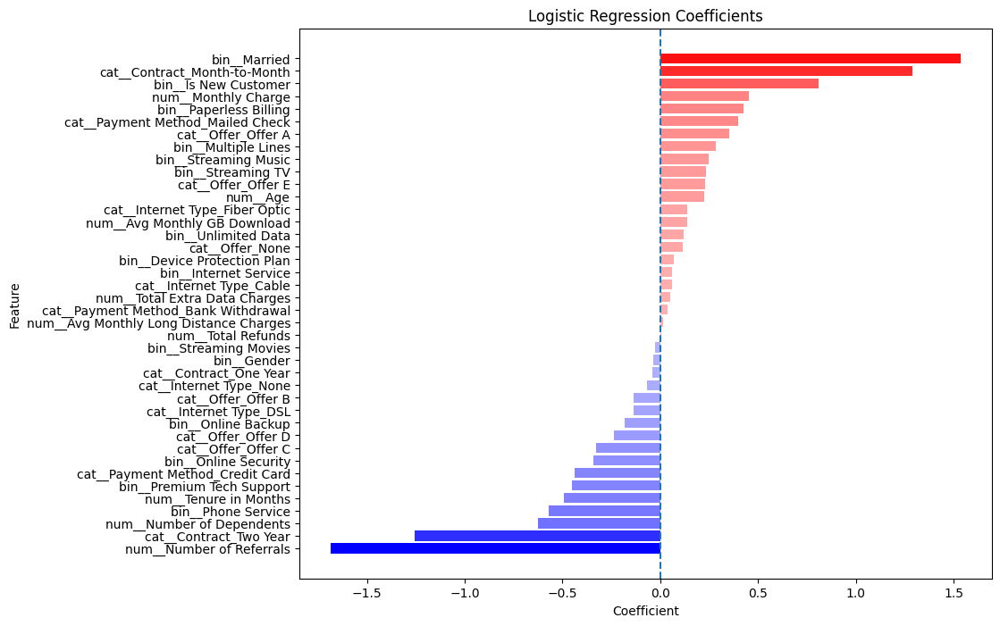

# Telecom Customer Churn Prediction

## Project Overview
A reproducible analysis and modeling project to predict customer churn for a California telecommunications provider (Q2 2022). The repository contains a runnable Jupyter notebook with data cleaning, EDA, feature engineering, model training (Logistic Regression, Random Forest, XGBoost, CatBoost), hyperparameter tuning, and threshold optimization.

Key files:
- Analysis notebook: [notebook.ipynb](notebook.ipynb)
- Datasets: [dataset/telecom_customer_churn.csv](dataset/telecom_customer_churn.csv), [dataset/telecom_zipcode_population.csv](dataset/telecom_zipcode_population.csv)
- Environment: [requirements.txt](requirements.txt)

## Description
This project demonstrates end-to-end churn modeling:
- Domain-informed imputation and feature engineering
- Exploratory Data Analysis (distributions, correlations, churn drivers)
- Preprocessing pipelines with scaling, one-hot encoding, and SMOTE
- Model training, hyperparameter search, and threshold tuning focused on F1/ROC-AUC
- Comparative evaluation of model families (linear, tree-based, boosted, and CatBoost)

## Business Problem
Retain customers by identifying those at high risk of churning so that targeted retention actions (offers, support outreach, pricing adjustments) can be deployed. The goal is to maximize true positive detection of churners while keeping false positives manageable.

## Methodology
- **Data preprocessing**: domain-driven imputation, binary encoding, log-transform for skewed usage features.
- **Feature selection**: remove identifiers and leakage sources (Customer ID, Churn Reason, Churn Category, Customer Status).
- **Pipeline**:
  - **Logistic Regression** with scaled numeric features and one-hot encoded categoricals.
  - **Random Forest and XGBoost** using one-hot encoding + passthrough numeric/binary.
  - **CatBoost** using native categorical handling.
- **Imbalance handling**: SMOTE applied inside pipelines for applicable models.
- **Model selection**: Grid/Randomized search optimizing ROC-AUC (cross-validation).
- **Threshold tuning**: sweep thresholds to maximize F1-score (business trade-offs can use precision/recall constraints).

## Results
- Models compared using ROC-AUC, Accuracy, Precision, Recall, F1 with an F1-optimized threshold.

- Summary:
  - CatBoost and XGBoost generally achieved the best ROC-AUC.
  
  - Logistic Regression provided interpretable coefficients showing contract type and monthly charge as strong drivers.
    

  - Random Forest and boosting models identified contract type (month-to-month), monthly charge, and Offer E as top predictors.

## Business Impact
- With F1 score ~ 72%, the final model can detect most customers at risk, enabling prioritized retention campaigns. Even a small retention improvement could translate to significant revenue preservation given recurring subscription income.    
- Insights into drivers (contract type, pricing, offers, add-ons) can guide product and pricing strategy to reduce churn.
- Model scores (AUC/F1) provide measurable improvement over random selection, supporting prioritization of retention spend.

## Limitations
- Observational dataset from a single quarter and region (California, Q2 2022) — limited temporal/generalization scope.
- Possible residual data leakage if new features referencing future or outcome-derived fields are introduced.
- SMOTE oversampling may introduce synthetic examples that differ from real customer behavior; production scoring should use probability thresholds and business validation.
- Model fairness and causal inference not addressed — further checks needed before deployment to avoid biased interventions.

## Setup instructions
1. Open this workspace in VS Code or clone the repo.
2. Create and activate a virtual environment:
   - `python3 -m venv .venv`
   - `source .venv/bin/activate`  (macOS / Linux) or `.venv\Scripts\activate` (Windows)
3. Install dependencies:
   - `pip install -r requirements.txt`
4. Ensure datasets are present under the `dataset/` folder:
   - [dataset/telecom_customer_churn.csv](dataset/telecom_customer_churn.csv)
   - [dataset/telecom_zipcode_population.csv](dataset/telecom_zipcode_population.csv)

## Usage
- Open and run the notebook: [notebook.ipynb](notebook.ipynb). Run cells top-to-bottom to reproduce preprocessing, model training, tuning, and evaluation.
- To reproduce a single model training programmatically, extract corresponding pipeline cells from the notebook (e.g., Logistic Regression pipeline and search).

